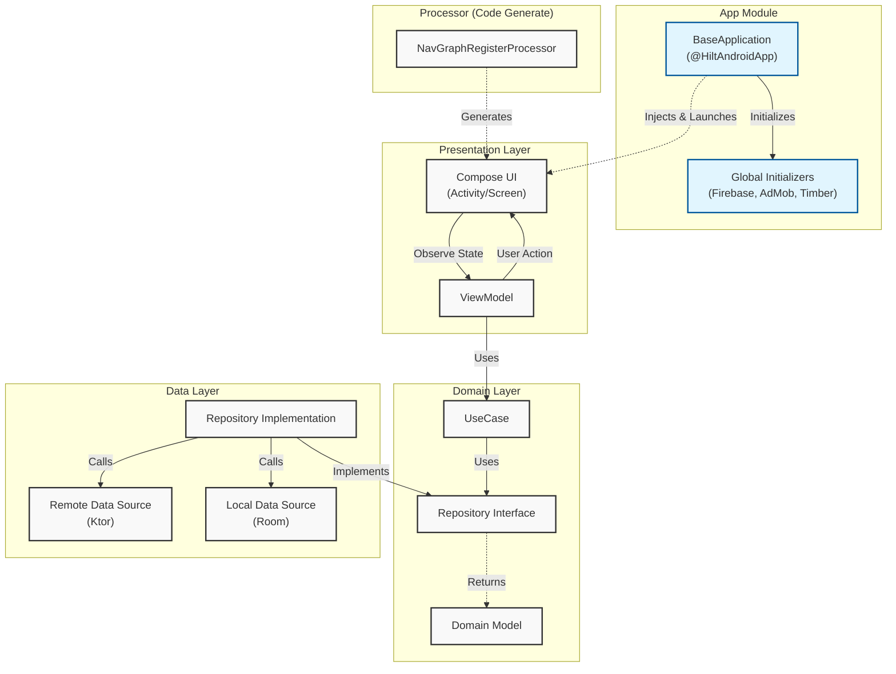
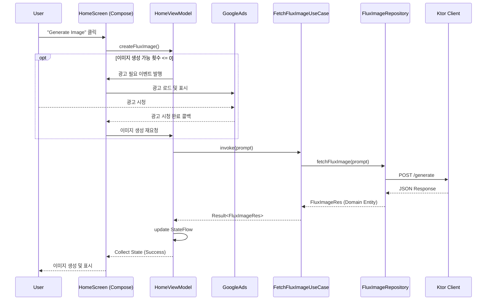

# KoreAi

**KoreAi**는 2025년 3월에 출시한, **Jetpack Compose**와 **Clean Architecture**를 기반으로 구축된 안드로이드 AI 이미지 생성 애플리케이션입니다.

기존 다른 이미지 생성 앱과는 달리 **Google Translation API** 와 연동하여 한국어로 이미지 생성이 가능합니다.

## 🛠 기술 스택 (Tech Stack)

*   **Language**: Kotlin
*   **UI**: Jetpack Compose
*   **Architecture**: Clean Architecture + MVVM
*   **Asynchronous**: Coroutines & Flow
*   **Network**: Ktor
*   **Local DB**: Room
*   **DI**: Hilt
*   **Image Loading**: Coil
*   **Navigation**: Navigation Compose (Custom KSP Processor 활용)
*   **Others**: Firebase, AdMob, Lottie

## 🏗 아키텍처 (Architecture)

이 프로젝트는 확장성, 테스트 용이성, 유지보수성을 보장하기 위해 **Clean Architecture** 원칙을 따릅니다.

### 모듈 구조
*   **app**: 애플리케이션 진입점 및 DI 설정
*   **presentation**: UI (Compose) 및 ViewModel
*   **domain**: 비즈니스 로직 (UseCase) 및 레포지토리 인터페이스 (순수 Kotlin)
*   **data**: 데이터 구현 (Repository, Ktor, Room)
*   **core**: 공통 유틸리티 및 확장 함수
*   **processor**: 내비게이션 그래프 자동 등록을 위한 커스텀 KSP 프로세서

### 아키텍처 다이어그램

## 🔄 데이터 흐름 (Data Flow)

사용자가 이미지 생성을 요청했을 때의 데이터 흐름도입니다.

## ✨ 주요 기능 (Key Features)

*   **텍스트-이미지 생성**: 상세한 텍스트 프롬프트를 사용하여 이미지 생성
*   **프롬프트 관리**: 이전에 생성된 이미지 프롬프트를 로컬에서 확인 및 관리
*   **커스텀 내비게이션**: KSP를 활용한 내비게이션 그래프 자동 등록